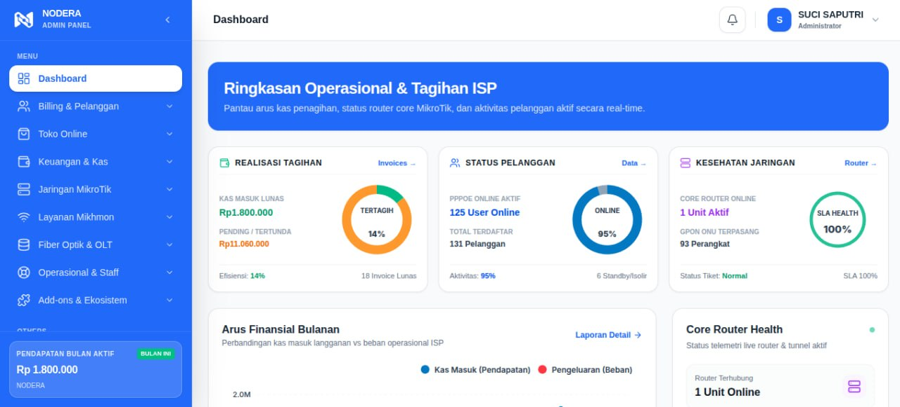
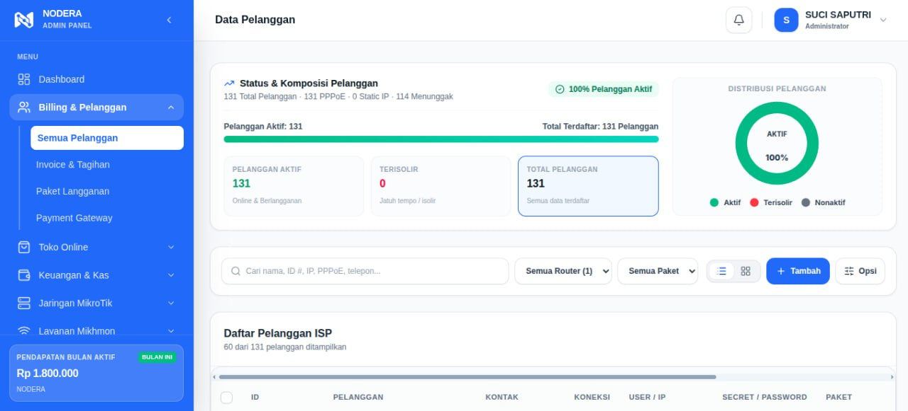
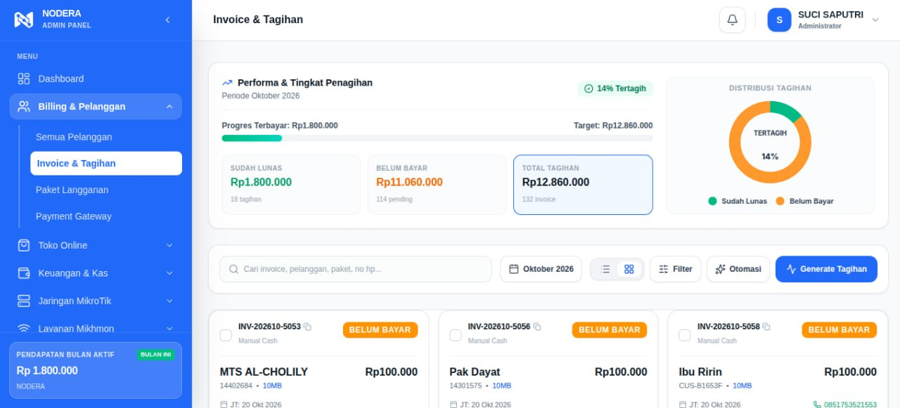
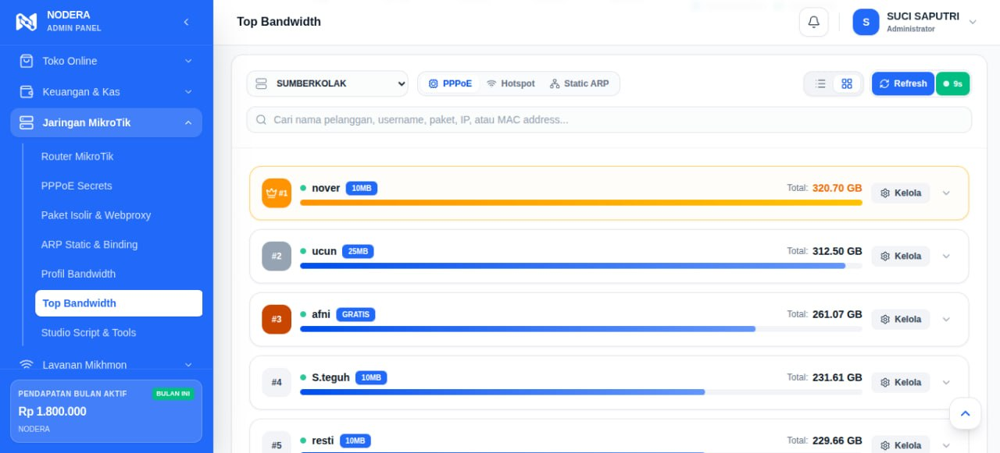
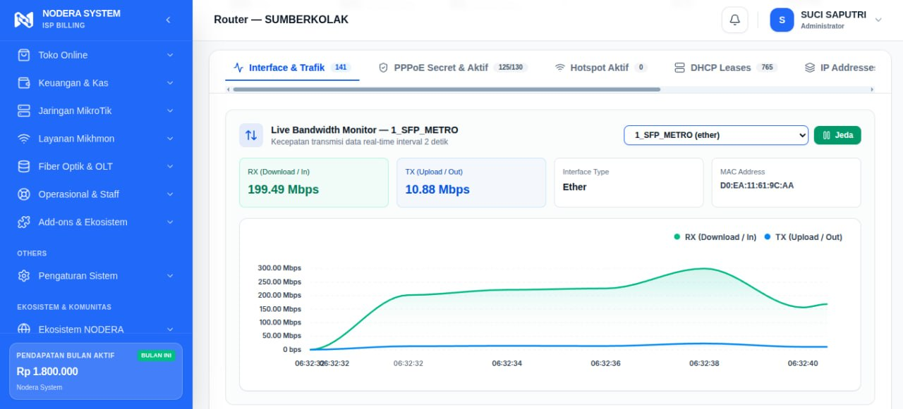

<div align="center">

# NODERA ISP & RT/RW NET BILLING SYSTEM
### Platform Manajemen ISP, Otomasi MikroTik RouterOS & Billing Penagihan Multi-Router

[](https://php.net)
[](https://laravel.com)
[](https://reactjs.org)
[](https://tailwindcss.com)
[](https://mikrotik.com)
[](https://panel.dgtlnetsolution.com/desktop-licenses)

</div>

---

## Ringkasan Sistem

**NODERA Billing** adalah platform otomasi manajemen ISP dan RT/RW Net all-in-one yang dirancang untuk performa tinggi, kemudahan operasional, dan keandalan sistem penagihan. Dibangun di atas arsitektur **Laravel 11, React (Inertia.js), dan TailAdmin**, aplikasi ini mengintegrasikan kontrol router MikroTik RouterOS v6/v7, provisi TR-069 GenieACS, manajemen penagihan multi-periode, telemetri jaringan real-time, dan pembayaran otomatis.

---

## Antarmuka & Fitur Utama

### 1. Dashboard Utama & Telemetri Jaringan
Monitoring realisasi penagihan bulanan, status pelanggan aktif vs menunggak, kesehatan router core, dan grafik arus kas finansial secara real-time.


### 2. Manajemen Pelanggan PPPoE & IP Statis
Pencatatan data pelanggan lengkap dengan integrasi RouterOS Secret, profil bandwidth, pemetaan ODP, koordinat lokasi, dan status koneksi langsung.


### 3. Invoice & Rekap Penagihan Bulanan
Sistem penagihan otomatis per periode dengan filter status pembayaran, pencatatan transaksi kasir, serta cetak invoice dan struk thermal.


### 4. Analisis Top Bandwidth Klien
Pemantauan konsumsi bandwidth kumulatif tertinggi dari pelanggan untuk audit traffic dan manajemen FUP jaringan.


### 5. Real-Time Interface Traffic Monitor
Grafik time-series kecepatan RX/TX interface router secara langsung untuk memantau beban gateway dan link transmisi.


---

## Fitur Unggulan

- **Otomasi MikroTik RouterOS (v6 & v7)**:
  - Pembuatan dan sinkronisasi PPP Secret, PPPoE Profile, dan IP Binding.
  - Fitur Auto-Isolir terjadwal untuk pelanggan menunggak via scheduler router.
  - Pemantauan traffic interface real-time, ping diagnostik, dan reboot remote.
- **Manajemen Operasional Lapangan**:
  - Hak akses khusus untuk Staf Teknisi dan Staf Kolektor Penagihan.
  - Integrasi pembagian komisi penagihan (persentase atau nominal tetap).
- **Ekosistem Pembayaran & Notifikasi**:
  - Integrasi NODERA Pay (Dynamic QRIS otomatis lunas).
  - WhatsApp Gateway untuk pengiriman tagihan, konfirmasi pembayaran, dan broadcast pengumuman.
  - Bot Telegram untuk alert sistem dan laporan keuangan harian.
- **Manajemen GPON / EPON (TR-069 GenieACS)**:
  - Provisi otomatis ONT pelanggan, pembacaan redaman optik (Rx Power), dan konfigurasi WiFi jarak jauh.

---

## Kebutuhan Sistem

- **Sistem Operasi**: Linux Ubuntu 22.04 / 24.04 LTS, Debian 11 / 12, atau AlmaLinux 9.
- **PHP**: Versi 8.2 atau 8.3 dengan ekstensi:
  - `bcmath`, `curl`, `dom`, `fileinfo`, `gd`, `json`, `mbstring`, `openssl`, `pdo_mysql`, `sodium`, `xml`, `zip`.
- **Database**: MySQL >= 8.0 atau MariaDB >= 10.6.
- **Web Server**: Nginx (direkomendasikan) atau Apache2.
- **Node.js**: Versi 20.x LTS & NPM.
- **Composer**: Versi 2.x.

---

---

## Panduan Menjalankan di Windows (1-Click Portable)

Persis seperti **Mikhmon Server**, aplikasi ini dapat langsung dijalankan di PC / Laptop Windows tanpa konfigurasi manual yang rumit:

1. Unduh repositori ini dalam bentuk **ZIP** melalui tombol hijau `Code` -> `Download ZIP` di GitHub, lalu ekstrak ke folder komputer Anda (misal `C:\Nodera-Billing`).
2. Buka folder hasil ekstrak, lalu **klik ganda (double-click)** pada berkas:
   - `START-NODERA.bat`
3. Launcher akan mendeteksi PHP di komputer Anda (atau otomatis mengunduh PHP Portable jika belum ada) dan menyiapkan database awal.
4. Browser web akan otomatis terbuka ke alamat login:
   - **Alamat Lokal**: `http://127.0.0.1:8080/login`
   - **Alamat Jaringan LAN**: `http://[IP-Komputer-Anda]:8080/login`
5. Untuk menghentikan aplikasi, klik ganda `STOP-NODERA.bat` atau tekan `Ctrl + C` pada jendela server.

## Panduan Instalasi di Linux VPS / Server

### 1. Unduh Source Code
```bash
git clone https://github.com/fitratan/Billing-RT-RW-NET-by-NODERA.git /var/www/nodera-billing
cd /var/www/nodera-billing
```

### 2. Salin Konfigurasi Environment
```bash
cp .env.example .env
```
Sesuaikan konfigurasi database pada file `.env`:
```env
DB_CONNECTION=mysql
DB_HOST=127.0.0.1
DB_PORT=3306
DB_DATABASE=nodera_billing
DB_USERNAME=billing_user
DB_PASSWORD=password_database_anda
```

### 3. Pasang Dependency Backend & Frontend
```bash
# Install dependency PHP
composer install --no-dev --optimize-autoloader

# Install dependency JavaScript & Compile Asset
npm install
npm run build
```

### 4. Generate Kunci Aplikasi & Inisialisasi Database
```bash
php artisan key:generate
php artisan storage:link
php artisan migrate --seed --force
```

### 5. Atur Hak Akses Direktori
```bash
chown -R www-data:www-data storage bootstrap/cache
chmod -R 775 storage bootstrap/cache
```

---

## Kredensial Default Login

Setelah proses migrasi dan seed selesai, buka aplikasi melalui browser:

- **URL Login**: `http://IP-SERVER/login`
- **Username**: `nodera`
- **Password**: `nodera`

*Segera ubah username dan password Anda setelah berhasil masuk pertama kali melalui menu Pengaturan Profil.*

---

## Konfigurasi Nginx (Virtual Host)

Buat file konfigurasi `/etc/nginx/sites-available/nodera-billing`:

```nginx
# Redirect HTTP ke HTTPS
server {
    listen 80;
    server_name billing.domain-anda.com;
    return 301 https://$host$request_uri;
}

# HTTPS Server Block dengan Security Headers
server {
    listen 443 ssl http2;
    server_name billing.domain-anda.com;
    root /var/www/nodera-billing/public;

    # SSL Certificates (Let's Encrypt / Custom)
    ssl_certificate /etc/letsencrypt/live/billing.domain-anda.com/fullchain.pem;
    ssl_certificate_key /etc/letsencrypt/live/billing.domain-anda.com/privkey.pem;
    ssl_protocols TLSv1.2 TLSv1.3;
    ssl_ciphers HIGH:!aNULL:!MD5;

    # Security Headers
    add_header X-Frame-Options "SAMEORIGIN" always;
    add_header X-Content-Type-Options "nosniff" always;
    add_header X-XSS-Protection "1; mode=block" always;
    add_header Referrer-Policy "strict-origin-when-cross-origin" always;
    add_header Strict-Transport-Security "max-age=31536000; includeSubDomains" always;

    index index.php;
    charset utf-8;

    location / {
        try_files $uri $uri/ /index.php?$query_string;
    }

    location = /favicon.ico { access_log off; log_not_found off; }
    location = /robots.txt  { access_log off; log_not_found off; }

    error_page 404 /index.php;

    location ~ \.php$ {
        fastcgi_pass unix:/var/run/php/php8.2-fpm.sock;
        fastcgi_param SCRIPT_FILENAME $realpath_root$fastcgi_script_name;
        include fastcgi_params;
        fastcgi_hide_header X-Powered-By;
    }

    location ~ /\.(?!well-known).* {
        deny all;
    }
}
```

Aktifkan SSL gratis otomatis menggunakan Certbot:
```bash
sudo certbot --nginx -d billing.domain-anda.com
```

Aktifkan konfigurasi dan muat ulang Nginx:
```bash
ln -s /etc/nginx/sites-available/nodera-billing /etc/nginx/sites-enabled/
nginx -t
systemctl reload nginx
```

---

## Lisensi & Edisi

| Fitur | Community Edition (Free) | Pro / Enterprise License |
| :--- | :--- | :--- |
| **Batas Pelanggan** | Maksimal 35 Pelanggan | **Unlimited Pelanggan** |
| **Batas Staf Lapangan** | 1 Teknisi / 1 Kolektor | **Unlimited Staf** |
| **Manajemen PPPoE & Hotspot** | Aktif | **Aktif** |
| **Auto-Isolir MikroTik** | Manual | **Otomatis Terjadwal** |
| **WhatsApp Gateway Broadcast** | Nonaktif | **Aktif Terintegrasi** |
| **NODERA Pay QRIS Otomatis** | Nonaktif | **Aktif Terintegrasi** |
| **TR-069 GenieACS ONT** | Nonaktif | **Aktif Terintegrasi** |

Untuk aktivasi lisensi Pro atau enterprise, silakan kunjungi portal lisensi resmi di [panel.dgtlnetsolution.com/desktop-licenses](https://panel.dgtlnetsolution.com/desktop-licenses).

---

## Informasi Kontak & Pembelian Lisensi

- **Portal Pembelian Lisensi**: [panel.dgtlnetsolution.com/desktop-licenses](https://panel.dgtlnetsolution.com/desktop-licenses)
- **Telegram**: [@nullneko_exe](https://t.me/nullneko_exe)

---

<div align="center">
  <b>NODERA</b><br>
  Digital Network Solution<br>
  <i>Empowering Local ISPs with High-Performance Technology</i>
</div>
